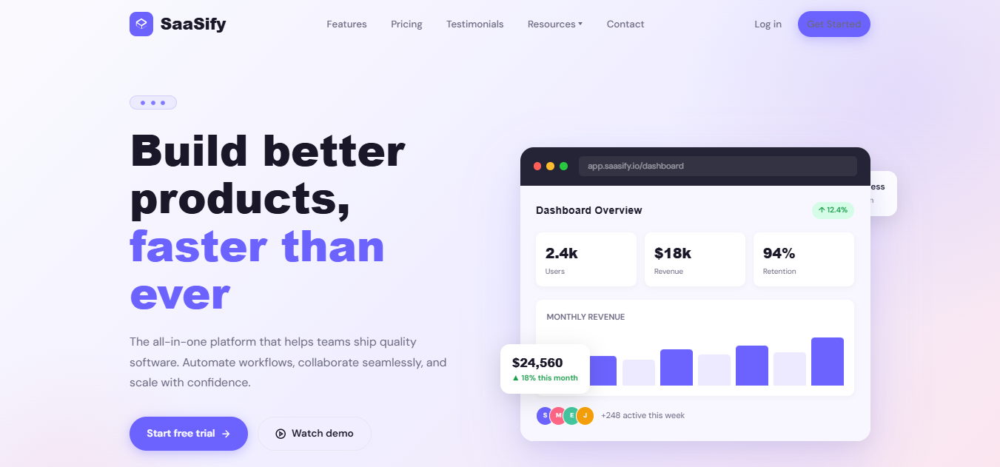
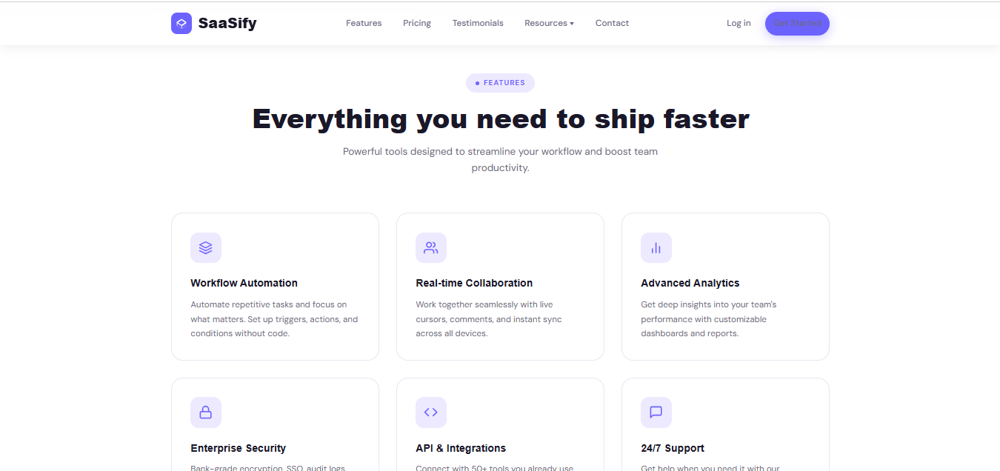
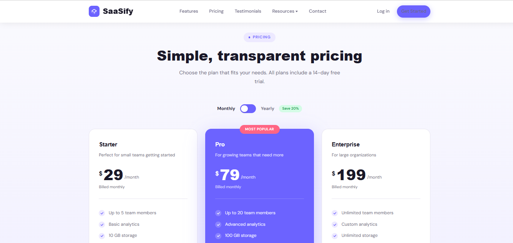
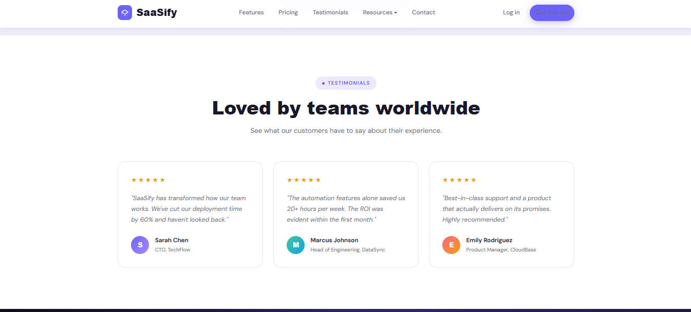
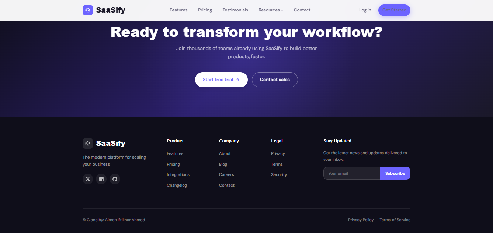

# Website Clone Project

This is a responsive website clone built using **HTML, CSS, and JavaScript**.  
The purpose of this project is to improve frontend development skills by recreating a real-world UI design.

## 🚀 Features
- Fully responsive layout
- Clean and modern UI design
- Interactive elements using JavaScript
- Mobile-friendly structure

## 🛠️ Technologies Used
- HTML5
- CSS3
- JavaScript (Vanilla JS)

## 📸 Project Screenshots

### Hero Section

### Features

### Pricing

### Testimonial

### Footer

## 📌 Purpose
This project was built for learning and practice purposes to strengthen frontend development skills.

## 👩‍💻 Author
Aiman Iftikhar
